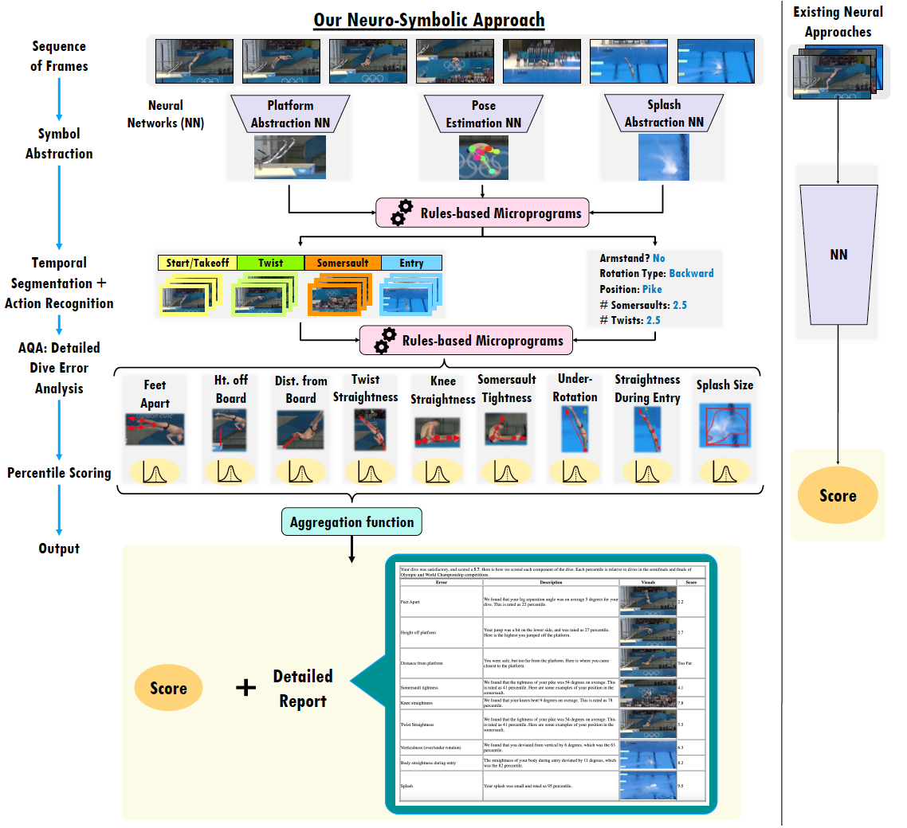

# Neuro-Symbolic AQA (NS-AQA) 
## 🏆 CVPR 2024 CVSports Best Paper Award
This repository contains the Python code implementation of NS-AQA for platform diving.

Technical Paper: [link](https://arxiv.org/abs/2403.13798)

Demo: [link](https://huggingface.co/spaces/X-NS/NSAQA)

## Overview
We propose a neuro-symbolic paradigm for AQA.


## Run NS-AQA
Score Report is saved as an HTML file at "./output/"

Run NS-AQA on a single dive clip.
```
python nsaqa.py path/to/video.mp4
```
Run NS-AQA on a single dive from the [FineDiving Dataset](https://github.com/xujinglin/FineDiving). Each dive in the dataset has an instance id (x, y).
```
python nsaqa_finediving.py x y

# e.g. if the instance id is ('01', 1)
python nsaqa_finediving.py 01 1
```

## Please consider citing our work:
```
@inproceedings{okamoto2024hierarchical,
  title={Hierarchical NeuroSymbolic Approach for Comprehensive and Explainable Action Quality Assessment},
  author={Okamoto, Lauren and Parmar, Paritosh},
  booktitle={Proceedings of the IEEE/CVF Conference on Computer Vision and Pattern Recognition},
  pages={3204--3213},
  year={2024}
}
```
